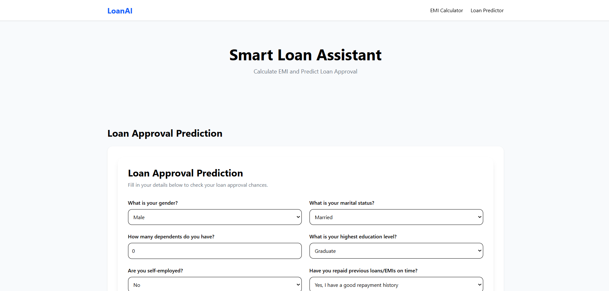
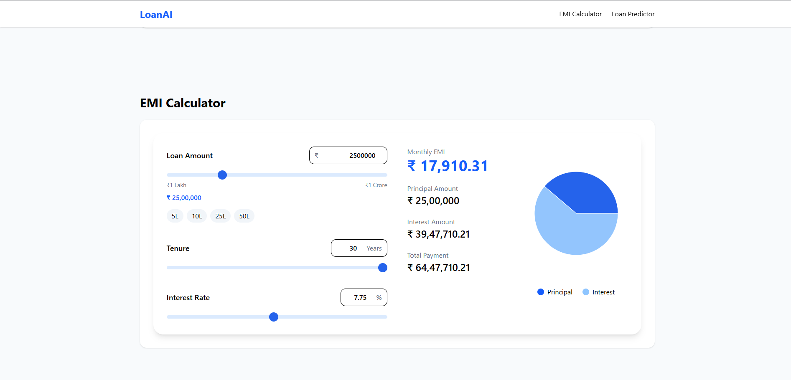
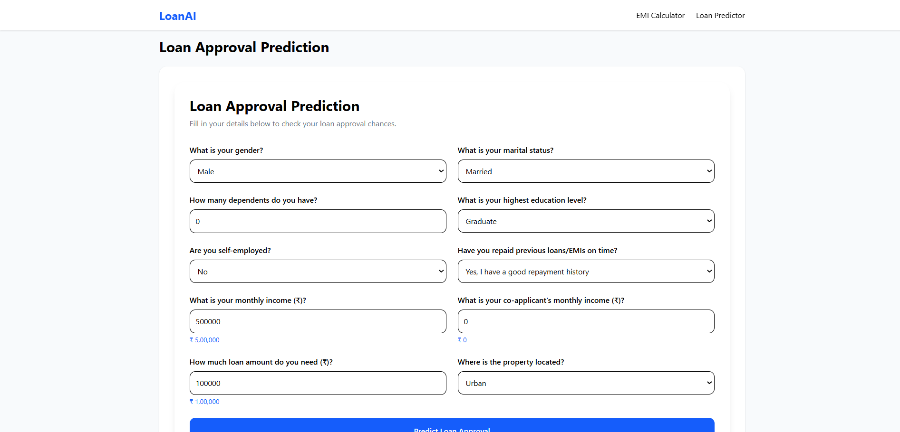
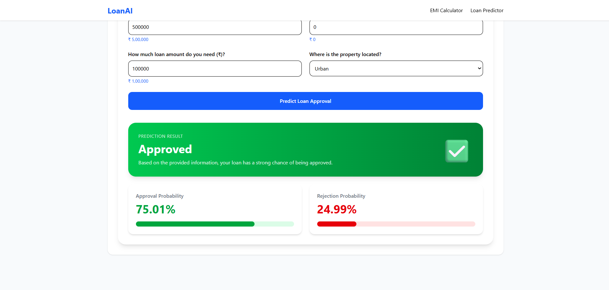

# LoanAI - Loan Approval Prediction & EMI Calculator

## Overview

LoanAI is a full-stack Machine Learning application that predicts loan approval status and calculates EMI (Equated Monthly Installment) for home loans.

The project combines Machine Learning, FastAPI, React, and Tailwind CSS to provide users with an interactive platform for checking loan eligibility and understanding loan repayment details.


---

## Problem Statement

Financial institutions consider multiple factors before approving a loan application. The goal of this project is to build a machine learning model that predicts whether a loan application is likely to be approved based on applicant information.

Additionally, an EMI calculator is provided to help users estimate their monthly loan repayment obligations before applying.

---

## Features

### Loan Approval Prediction

* Predicts loan approval status.
* Displays approval probability.
* Displays rejection probability.
* User-friendly loan application form.
* Real-time predictions through FastAPI APIs.

### EMI Calculator



* Monthly EMI calculation.
* Total interest calculation.
* Total repayment calculation.
* Interactive sliders and manual inputs.
* Principal vs Interest visualization using pie charts.

---

## Dataset Features

The machine learning model uses the following features:

| Feature           | Description                 |
| ----------------- | --------------------------- |
| Gender            | Applicant gender            |
| Married           | Marital status              |
| Dependents        | Number of dependents        |
| Education         | Education level             |
| Self_Employed     | Employment status           |
| ApplicantIncome   | Applicant monthly income    |
| CoapplicantIncome | Co-applicant monthly income |
| LoanAmount        | Requested loan amount       |
| Loan_Amount_Term  | Loan repayment duration     |
| Credit_History    | Previous repayment history  |
| Property_Area     | Property location           |



### Target Variable

**Loan_Status**

* 1 → Approved
* 0 → Rejected

---

## Data Cleaning & Preprocessing

Before training the model, the dataset was cleaned and preprocessed.

### Missing Value Handling

Categorical columns were filled using the most frequent value (Mode):

* Gender
* Married
* Dependents
* Self_Employed
* Credit_History

Numerical columns were filled using the Median:

* LoanAmount
* Loan_Amount_Term

### Additional Preprocessing

* Converted `"3+"` dependents into numeric value `3`.
* Removed `Loan_ID` because it does not contribute to prediction.
* Encoded categorical features using Label Encoding.
* Converted loan-related monetary values into Indian Rupee representation for a more realistic user experience.

---

## Machine Learning Workflow

### Step 1

Load and clean the dataset.

### Step 2

Split the dataset into:

* Training Data (80%)
* Testing Data (20%)

### Step 3

Train multiple machine learning models.

### Step 4

Evaluate models using Accuracy Score.

### Step 5

Select the best-performing model and save it using Joblib.

---

## Models Evaluated

| Model                    | Accuracy |
| ------------------------ | -------- |
| Logistic Regression      | 78.86%   |
| Decision Tree Classifier | 69.11%   |
| Random Forest Classifier | 75.61%   |
| Gaussian Naive Bayes     | 65.04%   |

---

## Final Model Selection

After evaluating multiple classification algorithms, **Logistic Regression** achieved the highest accuracy and was selected as the final model.

### Final Accuracy

**78.86%**

The trained model is saved using Joblib and served through FastAPI APIs for real-time predictions.

---

## Prediction Output

The model returns:

* Loan Approval Status
* Approval Probability
* Rejection Probability




### Example

```json
{
  "approved": true,
  "result": "Approved",
  "approved_probability": 87.10,
  "rejected_probability": 12.90
}
```

This helps users understand not only the prediction but also the confidence of the model.

---

## Technologies Used

### Frontend

* React
* Vite
* Tailwind CSS
* Axios
* Recharts

### Backend

* FastAPI
* Pandas
* Scikit-Learn
* Joblib

### Machine Learning

* Logistic Regression
* Decision Tree
* Random Forest
* Gaussian Naive Bayes

---

## Key Learnings

Through this project, I gained hands-on experience with:

* Data Cleaning and Preprocessing
* Feature Engineering
* Label Encoding
* Classification Algorithms
* Model Evaluation and Comparison
* REST API Development
* FastAPI Backend Development
* React Frontend Development
* Tailwind CSS
* Data Visualization
* End-to-End Machine Learning Deployment

---

## Author

**Vishal Yadav**

Machine Learning • FastAPI • React • Full Stack Development
